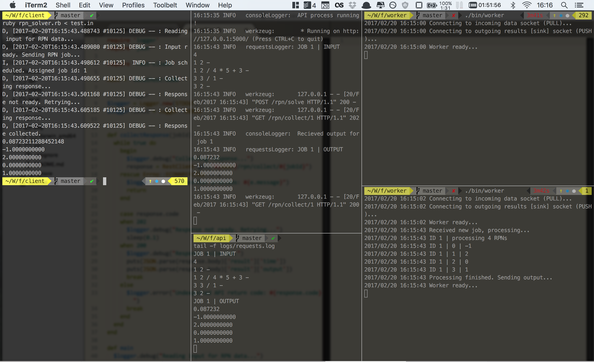

## RPN solving system prototype

### Workers (Go)

Go-lang based RPN problem solvers. Inputs taken from _zeroMQ_ queue (requests filled by API), output propagated to another [sink] queue.

### API (Python)

_Flask_ based API providing two endpoints and sink coroutine:

- `POST /rpn/solve` `{'rpn': <input-data>}` -> `<job-id>`
- `GET /rpn/collect/<job-id>` -> `<json-results>`
- sink routine for yielding the results and timing the execution

### Client (Ruby)

Console client for requests handling.

## Running example

